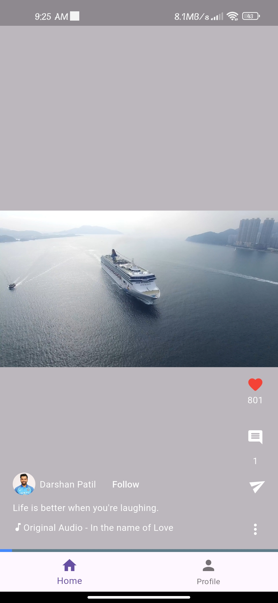
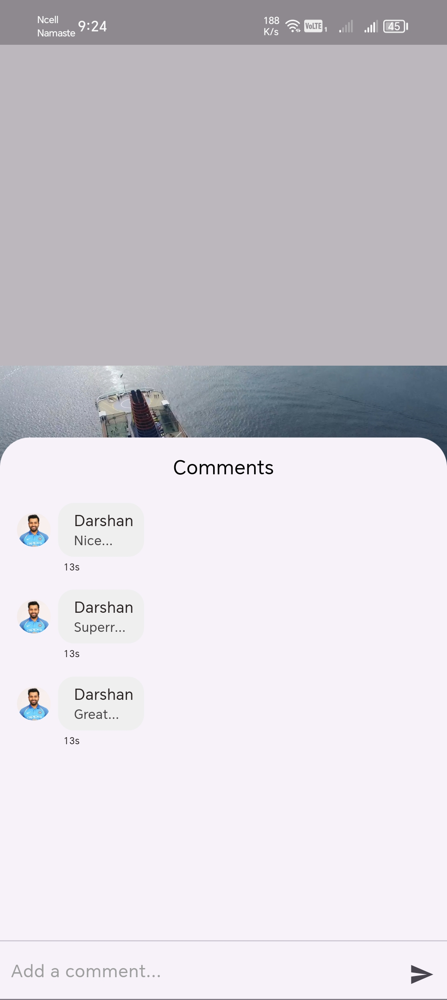
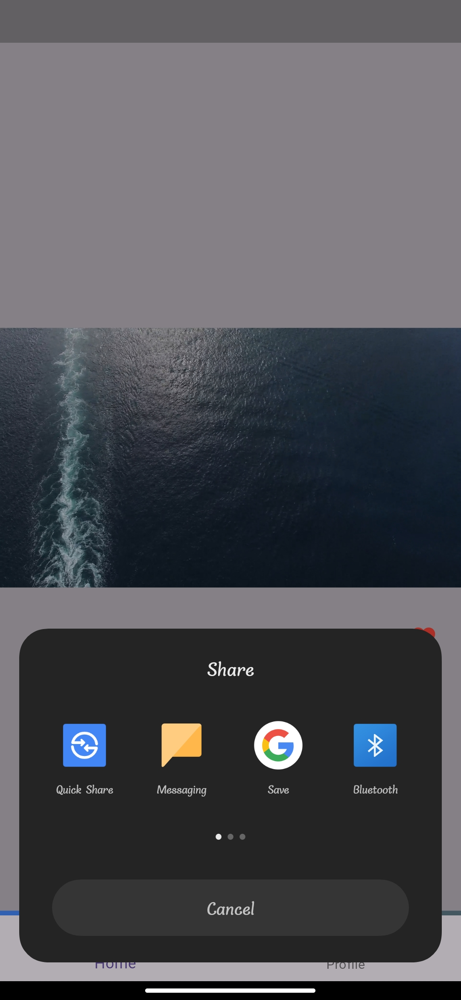

# Reel  

A modern Flutter application that emulates a TikTok-style video feed. Users can view vertically scrollable videos, interact through comments and sharing, and experience seamless user authentication.  

## Features  

### User Authentication  
- **Firebase Authentication**:  
  - Supports registration and login using email/password or Google Sign-In.  
  - Secure and user-friendly authentication flow.  

### Video Feed  
- Displays a list of 14 videos, with one containing audio and others being silent.  
- Vertically scrollable feed with only one video playing at a time for better performance.  
- Smooth video playback optimized for various devices.  

### Comments  
- Dedicated comment section for each video.  
- Local storage for all comments using Hive for persistence.   

### Share Feature  
- Allows sharing of video links using the native share dialog of the device.  

### State Management  
- Utilizes **Bloc** for modular and maintainable state management.  

### Data Privacy  
- Local data, including comments and session-related information, is cleared upon user logout.  

### Responsive UI/UX  
- Clean, user-friendly design adaptable to various screen sizes.  
- Intuitive navigation and interaction for enhanced user experience.  

## Screenshots  

### Home Screen  
  

### Comment View  
  

### Share View  
  

## Installation  

Follow these steps to set up and run the app:  

1. **Clone the Repository**:  
   ```bash  
   git clone https://github.com/rohan-165/reel.git  
   cd reel  


 
You can save this content in your `README.md` file directly. Let me know if you need help with any specific part of the project setup or codebase!
  
